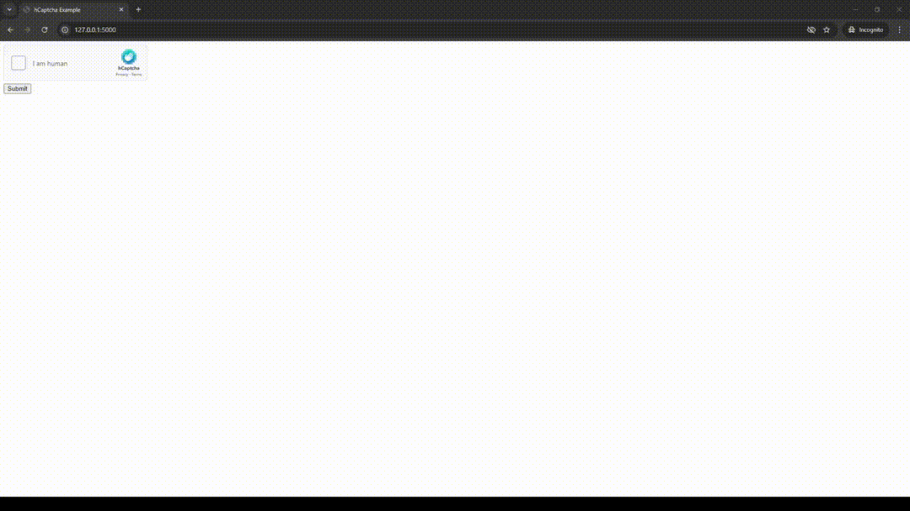

# 🔐 **Flask hCaptcha Integration** 🔐

## Preview

A simple Flask application that integrates hCaptcha for spam protection and bot detection on forms.

## Prerequisites
- **Python 3.x**: Ensure you have [Python 3.x](https://www.python.org/downloads/) installed.
- **Flask**: Install Flask using pip.
- **hCaptcha Account**: Sign up at [hCaptcha](https://www.hcaptcha.com/) to get your site key and secret key.

## Building and Running

1. **Clone the repository**:
   ```bash
   git clone https://github.com/GitEagleY/Flask_hCaptcha.git
   cd Flask_hCaptcha
   ```

2. **Create a virtual environment**:
   ```bash
   python -m venv venv
   source venv/bin/activate    # On Unix
   venv\Scripts\activate        # On Windows
   ```

3. **Install dependencies**:
   ```bash
   pip install -r requirements.txt
   ```

4. **Set up environment**:
   ```python
        # Replace with your actual hCaptcha keys
        SITE_KEY = 'your_key'
        SECRET_KEY = 'your_key'
        VERIFY_URL = 'https://hcaptcha.com/siteverify'
   ```

5. **Run the app**:
   ```bash
   python main.py
   ```
   or
      ```bash
   flask --app main.py run
   ```

6. **Access the app**:
   Navigate to `http://127.0.0.1:5000/` in your browser.

## Technologies Used
- **Backend**: Flask
- **hCaptcha**: For bot protection on forms

## Contributions
Feel free to fork the repository, create a feature branch, and submit a pull request!
